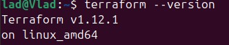
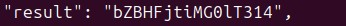
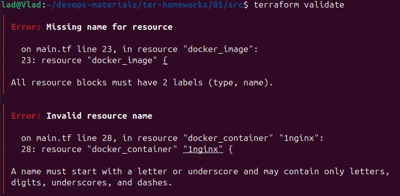
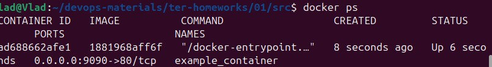
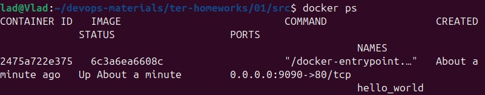
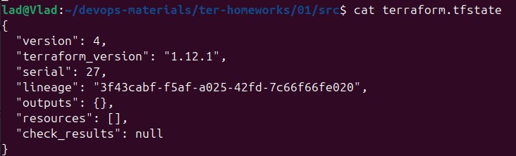

# Домашнее задание к занятию "Уязвимости и атаки на информационные системы" - `Вялов Владислав`

## Задание 1

### 1.0 
 

 ### 1.2

 Согласно .gitignore, для личной информации (логины, пароли, токены) допустимо использовать terraform.tfvars или любые файлы с расширением *.auto.tfvars

 ### 1.3

 

  ### 1.4

  

  

После раскоментирования блока кода, при выполнении команды terraform validate получаем две ошибки:
1. Необходимо задать два значения (type, name) для resource
2. Ошибка в названии resource "docker_container" "1nginx" - имя должно начинаться с буквы или символа нижнего подчеркивания.

 ### 1.5

 

  ### 1.6

  

  resource "docker_image" "nginx" {
  name         = "nginx:latest"
  keep_locally = true 
}

keep_locally Если значение true, то изображение Docker не будет удалено при операции destroy. Если значение false, то изображение будет удалено из локального хранилища docker при операции destroy
